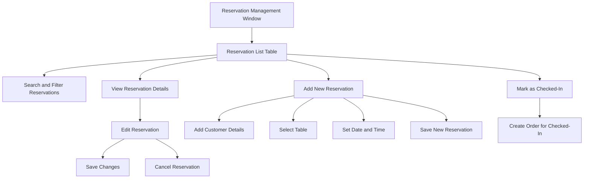

```mermaid
flowchart TD
    A[Reservation Management Window] --> B[Reservation List Table]
    B --> C[Search and Filter Reservations]
    B --> D[View Reservation Details]
    D --> E[Edit Reservation]
    E --> F[Save Changes]
    E --> G[Cancel Reservation]
    B --> H[Add New Reservation]
    H --> I[Add Customer Details]
    H --> J[Select Table]
    H --> K[Set Date and Time]
    H --> L[Save New Reservation]
    B --> M[Mark as Checked-In]
    M --> N[Create Order for Checked-In]
```

* dscs

###### 
``

```mermaid 
flowchart TD
    A[Reservation Management Window] --> B[Reservation List Table]
    B --> C[Search and Filter Reservations]
    B --> D[View Reservation Details]
    D --> E[Edit Reservation]
    E --> F[Save Changes]
    E --> G[Cancel Reservation]
    B --> H[Add New Reservation]
    H --> I[Add Customer Details]
    H --> J[Select Table]
    H --> K[Set Date and Time]
    H --> L[Save New Reservation]
    B --> M[Mark as Checked-In]
    M --> N[Create Order for Checked-In]
```

